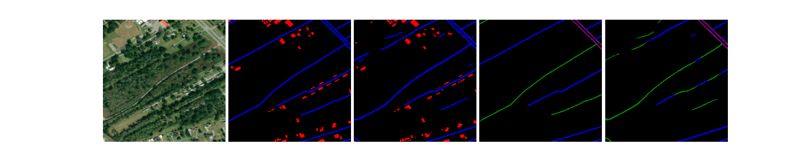
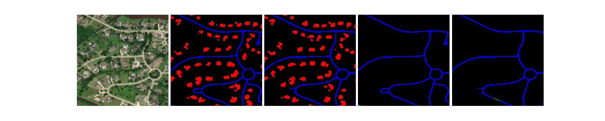
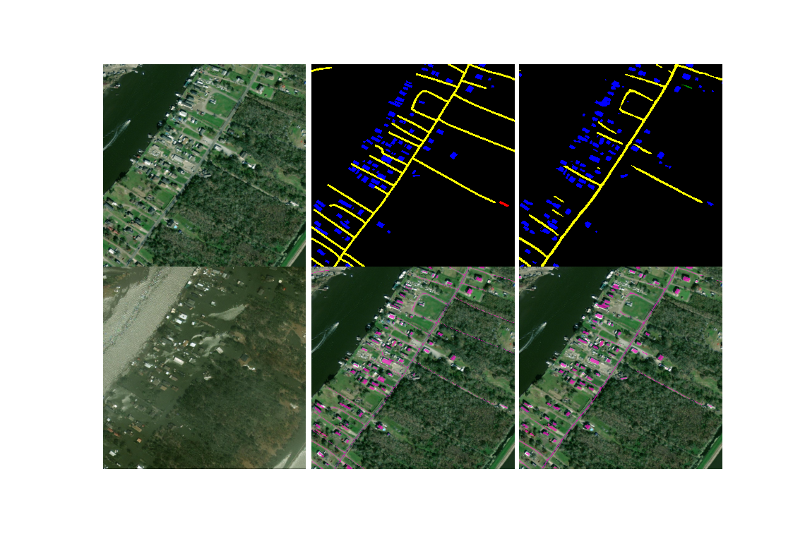
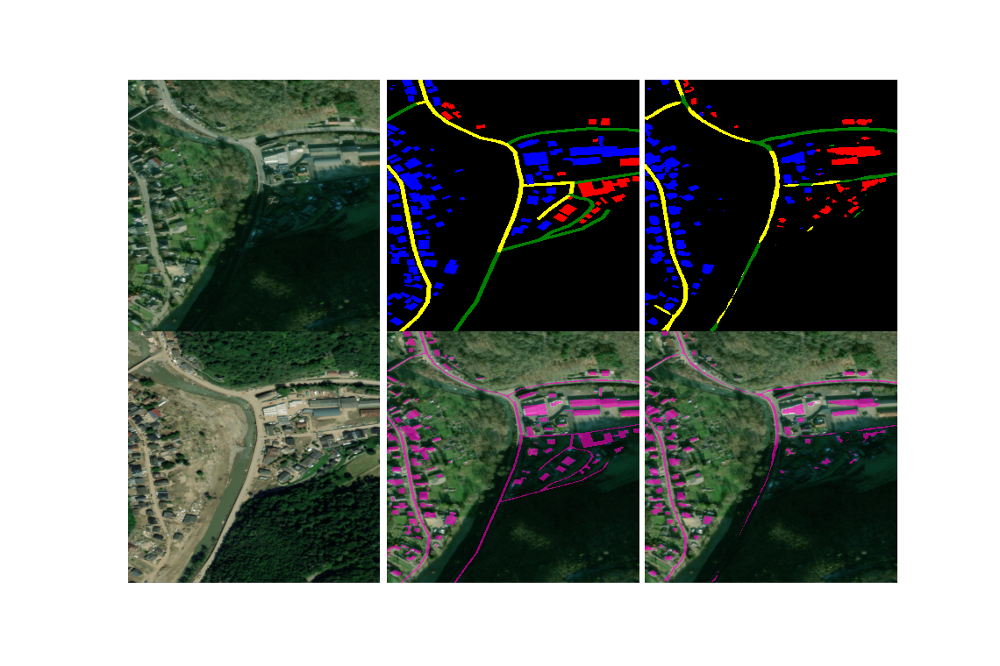

# spacenet8 

- [spacenet](https://spacenet.ai/)
- [Topcoder](https://www.topcoder.com/challenges/a6c49990-e4a9-4e90-a731-4cc6502e6beb?tab=details)

spacenet8: https://spacenet.ai/sn8-challenge/

## public 7th Solution 

## inference samples

- foundation




- flood



### competition code manegemanet
for develop logging and sharing

### Folders
```
├── LICENSE
├── README.md
├── SpaceNet8
│   ├── LICENSE
│   ├── README.md
│   ├── baseline
│   │   ├── __init__.py
│   │   ├── analysis_val.ipynb
│   │   ├── baseline.ipynb
│   │   ├── baseline_flood.ipynb
│   │   ├── baseline_flood.py
│   │   ├── baseline_flood_fine.py
│   │   ├── baseline_foundation.ipynb
│   │   ├── baseline_foundation.py
│   │   ├── baseline_foundation_fine.py
│   │   ├── core
│   │   │   ├── __init__.py
│   │   │   └── losses.py
│   │   ├── data_prep
│   │   │   ├── __init__.py
│   │   │   ├── add_speed_to_geojson.py
│   │   │   ├── create_masks.py
│   │   │   ├── generate_train_val_test_csvs.py
│   │   │   └── geojson_prep.py
│   │   ├── datasets
│   │   │   ├── __init__.py
│   │   │   └── datasets.py
│   │   ├── eda.ipynb
│   │   ├── flood_eval.py
│   │   ├── flood_inf.py
│   │   ├── foundation_eval.py
│   │   ├── foundation_inf.py
│   │   ├── generate_area_folds_csvs.ipynb
│   │   ├── generate_clean-v2_folds_csvs.ipynb
│   │   ├── generate_clean-v3_folds_csvs.ipynb
│   │   ├── generate_clean-v4_folds_csvs.ipynb
│   │   ├── generate_clean-v5_folds_csvs.ipynb
│   │   ├── generate_clean_folds_csvs.ipynb
│   │   ├── generate_folds_csvs.ipynb
│   │   ├── generate_fulltrain_csvs.ipynb
│   │   ├── generate_test_csv.ipynb
│   │   ├── inference_flood.ipynb
│   │   ├── inference_flood_ensemble.ipynb
│   │   ├── inference_foundation.ipynb
│   │   ├── make_submit.ipynb
│   │   ├── models
│   │   │   ├── __init__.py
│   │   │   ├── other
│   │   │   │   ├── __init__.py
│   │   │   │   ├── siamnestedunet.py
│   │   │   │   ├── siamunetdif.py
│   │   │   │   └── unet.py
│   │   │   └── pytorch_zoo
│   │   │       ├── __init__.py
│   │   │       ├── abstract_model.py
│   │   │       ├── inception.py
│   │   │       ├── resnet.py
│   │   │       ├── senet.py
│   │   │       └── unet.py
│   │   ├── multi_task.ipynb
│   │   ├── postprocessing
│   │   │   ├── __init__.py
│   │   │   ├── buildings
│   │   │   │   ├── __init__.py
│   │   │   │   └── building_postprocessing.py
│   │   │   ├── create_submit.ipynb
│   │   │   └── roads
│   │   │       ├── __init__.py
│   │   │       ├── create_submission.py
│   │   │       ├── infer_speed.py
│   │   │       ├── road_post.sh
│   │   │       ├── road_post_test.sh
│   │   │       ├── speed_conversion_key.csv
│   │   │       ├── utils
│   │   │       │   ├── apls_plots.py
│   │   │       │   ├── apls_tools.py
│   │   │       │   ├── make_logger.py
│   │   │       │   ├── rdp.py
│   │   │       │   ├── sknw.py
│   │   │       │   └── sknw_int64.py
│   │   │       ├── vectorize_roads.py
│   │   │       └── wkt_to_G.py
│   │   ├── utils
│   │   │   ├── __init__.py
│   │   │   ├── gt_geojson_to_wkt_csv.ipynb
│   │   │   ├── stitch.py
│   │   │   └── utils.py
│   │   └── visualize_dataset.ipynb
│   ├── docker
│   │   ├── Dockerfile
│   │   ├── requirements.txt
│   │   └── requirements_script.txt
│   └── open.sh
├── data
│   └── folds
├── eda
│   ├── eda.ipynb
│   └── requirements_eda.txt
├── requirements.yaml
├── submit
│   └── my_submit
│       ├── code
│       │   ├── Dockerfile
│       │   ├── README.md
│       │   ├── SpaceNet8
│       │   │   └── baseline
│       │   │       ├── __init__.py
│       │   │       ├── core
│       │   │       │   ├── __init__.py
│       │   │       │   └── losses.py
│       │   │       ├── data_prep
│       │   │       │   ├── __init__.py
│       │   │       │   ├── add_speed_to_geojson.py
│       │   │       │   ├── create_masks.py
│       │   │       │   ├── generate_train_val_test_csvs.py
│       │   │       │   └── geojson_prep.py
│       │   │       ├── datasets
│       │   │       │   ├── __init__.py
│       │   │       │   └── datasets.py
│       │   │       ├── generate_test_csv.py
│       │   │       ├── inference_flood.ipynb
│       │   │       ├── inference_flood.py
│       │   │       ├── inference_foundation.ipynb
│       │   │       ├── inference_foundation.py
│       │   │       ├── make_submit.ipynb
│       │   │       ├── make_submit.py
│       │   │       ├── models
│       │   │       │   ├── __init__.py
│       │   │       │   ├── other
│       │   │       │   │   ├── __init__.py
│       │   │       │   │   ├── siamnestedunet.py
│       │   │       │   │   ├── siamunetdif.py
│       │   │       │   │   └── unet.py
│       │   │       │   └── pytorch_zoo
│       │   │       │       ├── __init__.py
│       │   │       │       ├── abstract_model.py
│       │   │       │       ├── inception.py
│       │   │       │       ├── resnet.py
│       │   │       │       ├── senet.py
│       │   │       │       └── unet.py
│       │   │       ├── postprocessing
│       │   │       │   ├── __init__.py
│       │   │       │   ├── buildings
│       │   │       │   │   ├── __init__.py
│       │   │       │   │   └── building_postprocessing.py
│       │   │       │   ├── create_submit.ipynb
│       │   │       │   └── roads
│       │   │       │       ├── __init__.py
│       │   │       │       ├── create_submission.py
│       │   │       │       ├── infer_speed.py
│       │   │       │       ├── road_post.sh
│       │   │       │       ├── road_post_test.sh
│       │   │       │       ├── speed_conversion_key.csv
│       │   │       │       ├── utils
│       │   │       │       │   ├── apls_plots.py
│       │   │       │       │   ├── apls_tools.py
│       │   │       │       │   ├── make_logger.py
│       │   │       │       │   ├── rdp.py
│       │   │       │       │   ├── sknw.py
│       │   │       │       │   └── sknw_int64.py
│       │   │       │       ├── vectorize_roads.py
│       │   │       │       └── wkt_to_G.py
│       │   │       └── utils
│       │   │           ├── __init__.py
│       │   │           ├── gt_geojson_to_wkt_csv.ipynb
│       │   │           ├── stitch.py
│       │   │           └── utils.py
│       │   ├── data
│       │   │   └── Louisiana-West_Test_Public
│       │   ├── docker
│       │   │   ├── requirements.txt
│       │   │   └── requirements_script.txt
│       │   ├── test.sh
│       │   └── train
│       │       └── output
│       │           ├── flood
│       │           │   └── 3090_V5_clean-v3__timmu_IMG1312_hrnet_w18_fl-tr_b4
│       │           │       ├── 3090_fold-0
│       │           │       │   └── cfg.json
│       │           │       ├── 3090_fold-1
│       │           │       │   └── cfg.json
│       │           │       ├── 3090_fold-2
│       │           │       │   └── cfg.json
│       │           │       ├── 3090_fold-3
│       │           │       │   └── cfg.json
│       │           │       └── 3090_fold-4
│       │           │           └── cfg.json
│       │           └── foundation
│       │               └── A_V7_FINE_clean-v4__timmu_IMG1312_fl-tr_b4
│       │                   ├── A_fold-0
│       │                   │   └── cfg.json
│       │                   ├── A_fold-1
│       │                   │   └── cfg.json
│       │                   ├── A_fold-2
│       │                   │   └── cfg.json
│       │                   ├── A_fold-3
│       │                   │   └── cfg.json
│       │                   └── A_fold-4
│       │                       └── cfg.json
│       ├── solution
│       └── submit.sh
└── train

54 directories, 148 files
```